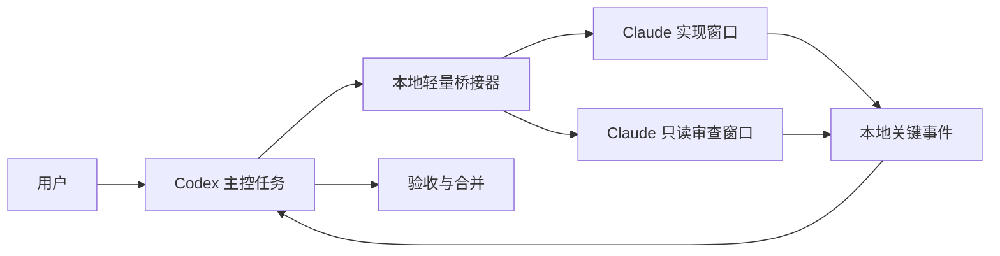

# Codex 指挥 Claude Code：轻量实施方案

状态：用户已确认共同理解；步骤 0 最小验证及正式桥接器的核心路径已有实测，未完成项见[实现状态](./实现状态.md)。已确认的行为以[协作需求](./协作需求.md)和[项目术语](../项目术语.md)为准；最初 PoC 见[最小验证记录](./最小验证记录.md)。

## 目标与分工

Codex 是主控：拆任务、选择执行模型、处理关键求助与敏感决策、决定验收和合并，也可以随时自己改代码。Claude Code 执行会话负责边界清楚的实现；有实质代码改动时，另一个只读 Claude Code 会话默认负责先审查和定向检查。Codex 只接收压缩后的关键事件、审查结论和必要证据；工具流水、完整对话和详细日志保留在本地供按需读取。

审查会话占用一个顶层并发名额，只读访问实现结果；它提交“结论、证据、定向检查结果、剩余风险”的短报告。Codex 对有争议或高风险的结论再查看代码和完整记录，最终是否合并仍由 Codex 决定。

## 最小运行结构

1. **桥接器**管理任务 ID、精确 Claude 会话 ID、进程状态、排队、上限、控制权和事件位置。先用现有 Node 项目与本地文件完成，不引入数据库或远端服务。每个任务只保存必要状态和事件索引；完整 Claude 对话留在 Claude Code 自己的记录中。
2. **终端代理**在 Windows 可见终端中转发 Claude Code 原生交互界面的输入输出。新会话由桥接器启动；既有后台会话优先尝试在托管终端 `attach`，其他既有窗口在当前轮结束后按精确 ID 续接。不能声称可直接操控另一个未托管的已开窗口。[Claude Agent View](https://code.claude.com/docs/en/agent-view)、[Windows ConPTY](https://learn.microsoft.com/en-us/windows/console/pseudoconsoles)分别支持会话附着和终端双向通道；组合效果仍需本机实测。
3. **权限回调**以用户要求的无限制模式启动，但优先试验叠加 `ask: ["*"]` 与 `PermissionRequest`，让每次工具调用都有权限决策路径。本地明确安全的普通操作快速放行；敏感或不确定操作才请求 Codex 判断。Codex 失联时不能自动放行，用户可在原生窗口手动批准或拒绝，决定写入简短审计事件。子代理沿用同一门禁。[通配规则](https://code.claude.com/docs/en/permissions#tool-name-wildcards)、[权限模式](https://code.claude.com/docs/en/permission-modes#actions-no-mode-auto-approves)与[权限回调](https://code.claude.com/docs/en/hooks#permissionrequest-decision-control)支持组成能力；失联时完整端到端行为需要验证。普通 `PreToolUse` 命令钩子单独使用无法保证超时后阻断，[官方超时规则](https://code.claude.com/docs/en/hooks#timeouts)已有说明。
4. **进度事件**只把任务开始、阶段结束、求助、权限待决、失败、完成和审查结论唤醒 Codex。其余工具事件在本地累积，Codex 按需取摘要或原始记录。指令状态分为已写入、已提交接收、处理中、已完成；写入或窗口回显不是处理回执。回执不明时停止自动重发，核对记录后再决定。
5. **配置读取**沿用用户当前 Claude Code／CCswitch 配置，仅允许选择当前配置提供的模型标识，不让 Codex 切换 CCswitch。任务启动后以当时配置为目标；配置热重载或本地路由改变导致无法固定时暂停并通知用户。[Claude 设置热重载](https://code.claude.com/docs/en/settings#when-edits-take-effect)、[CCswitch 本地路由](https://github.com/farion1231/cc-switch/blob/main/docs/user-manual/en/4-proxy/4.2-routing.md)使“进程已启动”不足以证明供应商不变。

现有 fork 的 `consult` 每次从 `claude -p` 启动，后台能力是状态轮询；这不能作为既有原生窗口的双向控制层，需替换任务与会话管理接口。[现有 MCP 工具定义](https://github.com/lordfine/claude-plugin-codex/blob/8eb1fc60/plugins/claude-code/scripts/claude-mcp-server.mjs#L94-L239) 旧接口无需强制兼容。

## 核心流程

| 场景 | 操作 | 关键边界 |
| --- | --- | --- |
| 新委派 | Codex 建独立 Git 工作树，读取当前配置和用户指定模型，排队或启动可见 Claude 窗口 | 默认每个主控任务并发 3 个顶层会话，最多 10 个；每个 Claude 会话子代理默认 8 个，最多 20 个 |
| 运行中调整 | Codex 发送有唯一 ID 的追加指令并等待提交和处理事件；用户输入时自动转人工接管 | 普通查看窗口不接管；Codex 主动接管默认等人类队列清空；立即接管才中断 |
| 交还控制权 | 用户在 Claude 窗口执行 `/交还`，或在 Codex 窗口要求接管 | `/交还` 用原生命令与本地回调实现，须实测；失败时保留 Codex 窗口入口 |
| 既有会话 | 用精确 Claude 会话 ID 识别目标；忙时等当前轮结束；优先原位接入，否则重启续接 | 保留原目录；双方修改同一文件时交替执行 |
| 完成与验收 | 实现会话交付摘要；独立只读审查会话检查差异和定向检查；Codex 裁决 | Claude 最多按反馈修复两轮；随后 Codex 接手能解决的部分；验收通过才合并 |
| 关闭或失联 | 关闭可见窗口只隐藏；Codex 离线时事件留本地；进程异常先查是否仍在运行再恢复一次 | 避免重复执行；状态不明时暂停并通知用户 |

默认任务上限为 90 分钟与主会话 120 轮，可逐任务调整。子代理轮次不计入 120 轮，但任务经过时间照常计入 90 分钟。合并冲突由 Codex 解决意图明确的部分；业务取舍不明时请用户决定。远端推送和生产部署按委派任务的显式授权执行。

## 先验证，再扩展

| 步骤 | 前置条件 | 交付与通过标准 | 失败时的处理 |
| --- | --- | --- | --- |
| 0. 原生路径最小验证 | 用户确认本方案；当前 Windows、Claude Code 与 CCswitch 配置可用 | 可见原生界面实时更新；新会话与指定既有会话可接入；运行中追加指令有分层回执；Esc 中断和人类接管可识别；`/交还` 可用；关闭再打开不丢进度 | 记录具体失败点，不继续扩展；把实证交给用户，再选择终端桥修复或其他窗口方式 |
| 0. 权限失联验证 | 原生路径可运行；仅用无破坏性的受控操作 | 主会话和子代理的普通工具能快速获批；敏感调用请求 Codex；门禁不可用时不得静默执行，可转人工提示；人工决定可追溯 | 不启用无限制自动执行；改用受限权限模式并与用户讨论后续方案 |
| 1. 新任务闭环 | 步骤 0 通过 | 独立工作树、可见窗口、事件等待、追加指令、暂停／取消、并发队列、上限生效 | 保存任务状态并暂停，不自动重派同一工作 |
| 2. 既有会话闭环 | 步骤 1 稳定；有明确会话 ID | 原位接入或按 ID 续接；保留目录和上下文；人工与 Codex 控制权可切换 | 保留原会话，不对未托管窗口注入指令；给出可恢复方式 |
| 3. 审查与合并 | 实现结果可定位且权限路径通过 | 只读审查会话给简短报告；Codex 验收、必要时修复或合并；离线事件可补读 | 保留工作树与记录，报告阻塞原因 |

步骤 0 是技术可行性闸口，不是完整产品开发。不会为验证而搭建持续服务、数据库或全量审计平台。验证过程使用当前用户配置的模型，模型调用数量控制在证明能力所需的最小范围。若原生窗口或权限组合未通过，不把未验证能力写成已交付。

## 当前确认点

这份方案的关键取舍是：原生 Claude Code 窗口优先、Codex 保留高强度决策、常规审查交给第二个 Claude 会话、权限与事件在本地轻量处理。用户确认共同理解后，才开始步骤 0 的实现与实测。
